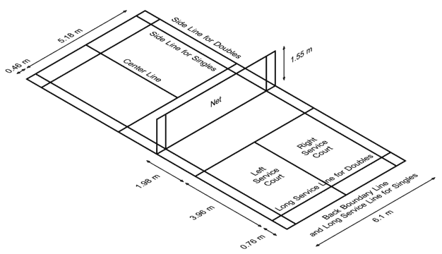

#Shuttle Triangulation

This folder has code that allows you to calibrate cameras, undistort images and triangulate objects using image pairs from 2 perspectives.

## To replicate the results, follow the steps below:

1. Go to select_points.py and select points on the image pairs. The points should be selected from left to right, bottom to top. The points are the intersections of lines on a Badminton Court. The ground truth location of these points is known and is defined in the calib.py file.

2. Run the cells step by step in the calib.py file. This will calibrate the cameras and save the necessary information in your working directory.

3. Run the cells step by step in the triangulate.py file. This will triangulate the points and plot the 3D points you selected during the first step.
    - When asked to select points in triangulate.py file, like the procedure in the first step, select the tips of the left and right net poles. We choose to test our triangulation on these points because we know their ground truth location and did not use them for calibration.

## To triangulate objects whose ground truth is unknown, follow the steps below:

1. If you don't have the camera matrices for the image pairs, perform calibration using points in the scene whose ground truth you know. Steps for calibration :
    - Use the `interactive_clicking_and_saving` function from utils.py to select correspoding points on the image pairs. 
    - Run the cells step by step in the calib.py file. This will calibrate the cameras and save the necessary information in your working directory.
    - Be mindful of the names you give your files. Change the names of the files in the calib.py file accordingly.

2. Once you have the camera matrices of the scenes, you can triangulate any object in the scene. Steps for triangulation :
    - Use the `interactive_clicking_and_saving` function from utils.py to select correspoding points on the image pairs. 
    - Run the cells step by step in the triangulate.py file. This will triangulate the points and plot the 3D points you selected during the first step. The last few cells can be ignored as they are for testing your triangulation on points whose ground truth is known, but were not used for calibration.

